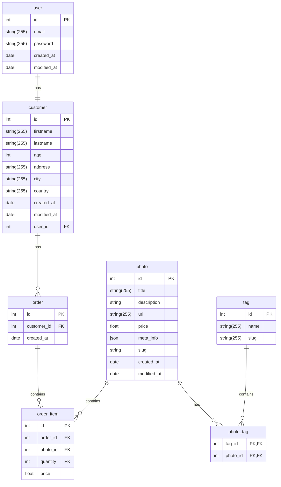

# Projet Symfony 7 - Photo Application

## 1. Diagramme entité-relation

```mermaid
erDiagram
    
    user {
        int id PK
        string(255) email
        string(255) password
        date created_at
        date modified_at
    }

    customer {
        int id PK
        string(255) firstname
        string(255) lastname
        int age
        string(255) address
        string(255) city
        string(255) country
        date created_at
        date modified_at
        int user_id FK
    }
    
    photo {
        int id PK
        string(255) title
        string description
        string(255) url
        float price
        json meta_info
        string slug
        date created_at
        date modified_at
    }

    order {
        int id PK
        int customer_id FK
        date created_at
    }

    order_item {
        int id PK
        int order_id FK
        int photo_id FK
        int quantity FK
        float price
    }

    tag {
        int id PK
        string(255) name
        string(255) slug
    }

    photo_tag {
        int tag_id PK, FK
        int photo_id PK, FK
    }

    user ||--|| customer : has
    customer ||--o{ order : has
    order ||--o{ order_item : contains
    photo ||--o{ order_item : contains
    photo ||--o{ photo_tag : has
    tag ||--o{ photo_tag : contains
```
